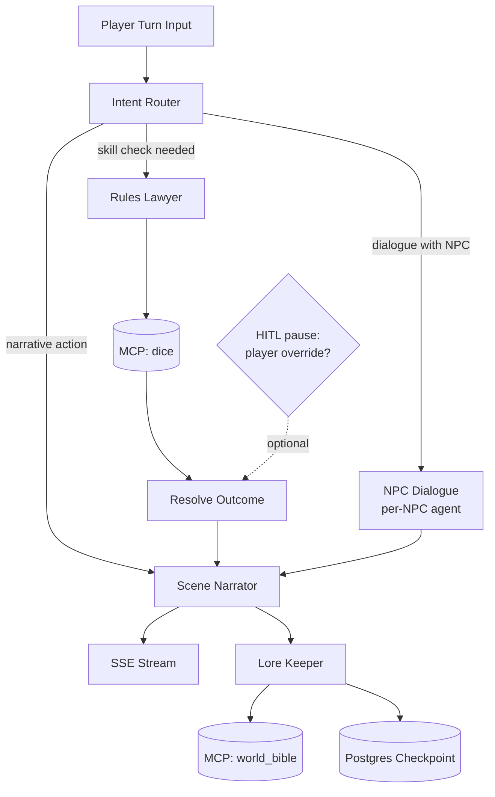

# Cairn — AI DM Platform

> A cairn is a stack of stones marking a path. Every session adds a stone to the trail the campaign has walked — that's the metaphor. The world remembers; the trail extends.

## What this is

A persistent-campaign TTRPG platform. Players run characters in long-running multi-session campaigns. An AI Dungeon Master narrates scenes, voices NPCs, runs skill checks, tracks lore. Sessions are saved; the world remembers what happened last week.

The point is to build a serious, production-shaped agent system end-to-end: fine-tuned specialist model, RAG with golden-set evals, multi-agent orchestration with persistent state, FastAPI with proper dependency injection, prompt versioning, custom exception hierarchy, AWS production stack (App Runner + Lambdas + SQS + SageMaker + Bedrock + S3 Vectors + EventBridge), IaC, CI/CD.

---

## What it feels like to play

You log in via Clerk, see a list of your campaigns or start a new one from a template. The campaign view shows the current scene description, your character sheet, the party, and the last few exchanges with the DM.

You type what you want to do — "I try to convince the guard the merchant is lying" — and hit send. The DM streams its response in real time over SSE: the scene narrator sets the moment, the rules lawyer decides this is a Persuasion check (DC 14), a dice prompt appears, you click to roll. The roll resolves on screen, the narrator weaves the outcome into the story, the guard (an NPC agent with its own voice) responds in character. The world updates silently in the background — the guard's attitude shifts, a new lore entry is written about the merchant's lie, the world bible vector store is updated.

When you close the tab, everything is checkpointed. Next week you open the same campaign and the DM remembers what the guard said, what your character is wearing, what the party owes the bartender. Once a night a summarizer Lambda compresses session transcripts into long-term lore so retrieval stays fast as the campaign grows.

---

## First playable slice (v1)

Concrete scope to ship before adding anything else:

- **Single-player, play-by-post.** No real-time multiplayer. No WebSocket complexity.
- **One pre-built campaign template** ("The Tavern at Grimwood Crossing"). One location, three NPCs (bartender, mysterious stranger, town guard), one obvious quest hook.
- **Skill checks only.** d20 + modifier vs DC. No combat, no spell system.
- **One session.** No multi-session persistence yet — that lands in v2.
- **Frontier model only.** Bedrock Claude or OpenAI. The fine-tuned DM voice model is v3 once we have a corpus and a golden eval baseline.
- **Local-only RAG.** Qdrant + sentence-transformers. S3 Vectors + SageMaker embeddings come when we go to AWS.
- **No image gen, no voice.** Text only.

What's still in v1 (the production discipline, not the product surface):

- Full FastAPI dependency injection
- Custom exception hierarchy + single error mapper
- Prompt versioning from prompt #1
- Golden eval set with at least one passing example per suite, wired into CI
- LangGraph turn graph with Postgres checkpointer
- MCP dice + character_sheet tools
- LiteLLM gateway (Ollama as a fallback for cheap local loops)
- Multi-stage Dockerfile + docker-compose with all local infra
- pytest pyramid (unit / integration / e2e)
- At least the `1_bootstrap` Terraform stack, even if we don't deploy the rest yet

**v1 is done when:** a player can log in, start the Tavern campaign, complete a 10-turn skill-check session end-to-end, and the eval suite passes in CI.

---

## Stack

### Core
- **Python 3.14** + **uv** for packages and venv
- **FastAPI** — async, native DI, pydantic v2
- **pydantic-settings** — layered env-driven config

### Data
- **PostgreSQL** + **SQLAlchemy 2 (async)** + **Alembic** migrations
- **Qdrant** (local dev) / **S3 Vectors** (prod) — vector store, swappable behind a Protocol
- **Redis** — cache, SSE pub/sub across instances, rate limiting, idempotency-key dedup

### LLM layer
- **LiteLLM** — single universal gateway in front of every provider; one call signature, model string decides routing
- **Ollama** — local models for dev / offline / cheap loops
- **Bedrock / OpenAI / Anthropic** — frontier, via LiteLLM
- **SageMaker serverless endpoint** — hosts the fine-tuned DM voice model, also via LiteLLM
- **sentence-transformers** (local) / **SageMaker** (prod) — embeddings, behind a Protocol

### Agent layer
- **LangGraph** — single orchestrator. Postgres checkpointer, HITL interrupts, multi-agent state machines. Persistent campaigns map directly to graph state checkpoints.
- **MCP Python SDK** — tool servers (dice, character sheet, bestiary, world bible) consumed as LangGraph nodes
- **Tenacity** — retries with exponential backoff for LLM calls

> **On orchestrator choice:** LangGraph alone, not stacked with another agents SDK. LangGraph already gives multi-agent + tool use + checkpointing + interrupts; layering a second framework on top would split state management. MCP gives us tool interop without needing a second agent SDK.

### Queues & background jobs
- **AWS SQS** (prod) / **ElasticMQ** (local, SQS-compatible Docker container) — durable queue, native DLQ
- **Taskiq** — modern async Python task framework on top of SQS; Celery-shaped ergonomics, async-native, pluggable broker
- Workers run as **Lambda functions** triggered by SQS event source mappings

> **Why not Celery + RabbitMQ:** Celery is sync-first and awkward with async FastAPI. RabbitMQ would be the only non-AWS-native piece in an otherwise AWS-native backend, and Amazon MQ adds infra cost for features we don't need (complex topic exchanges, AMQP routing). SQS is zero-infra, native DLQ, integrates with EventBridge and Lambda. Taskiq gives nice Python ergonomics on top.

### Observability
- **structlog** — JSON logs, request_id propagated everywhere
- **OpenTelemetry** — tracing, exported to CloudWatch
- **Langfuse** (self-hosted) — LLM-specific traces, prompt versions, eval dashboards
- **Sentry** — error tracking with release tagging

### Frontend
- **Next.js (App Router)** + **TypeScript** + **Tailwind**
- **Clerk** — auth + billing tiers
- **Zustand** — client state, **TanStack Query** — server state
- **SSE** for real-time DM stream

### Local dev
- **Docker** multi-stage (`base / dev / prod`)
- **docker-compose**: api + postgres + qdrant + redis + elasticmq (+ optional ollama on host)
- **Makefile** — every common command memorized

### Compute (AWS)
- **App Runner** — main FastAPI service. Long-running, SSE streaming, mounted MCP, min-1-instance to avoid cold starts.
- **Lambda (container image)** — webhooks, EventBridge cron jobs, SQS consumers, eval runners. One ECR image, multiple Lambda functions selecting different handlers.
- **SageMaker serverless endpoint** — fine-tuned DM voice model, embeddings.
- **EventBridge** — cron schedules + event bus.
- **API Gateway** — fronts the webhook Lambdas.

### Infra & CI/CD
- **Terraform** — per-concern stacks
- **GitHub Actions** + **OIDC → AWS** — no long-lived keys
- **pre-commit**: ruff format + ruff check + mypy + targeted tests

### Testing
- **pytest** + **pytest-asyncio**
- **testcontainers** — real Postgres + Qdrant + ElasticMQ in integration tests
- **pytest-vcr** — recorded LLM responses for e2e
- **Hypothesis** — property-based for domain logic (combat resolution, dice math)

### Fine-tuning
- **transformers + peft + trl** — QLoRA
- **HuggingFace datasets** — corpus management
- **Polars** — fast data curation
- **SageMaker SDK** — training jobs + serverless endpoint deploy

---

## Compute placement

| Workload | Where | Why |
| --- | --- | --- |
| Main HTTP API + SSE + MCP | **App Runner** | Long-running, persistent connections, min-1 keeps it warm. Lambda's 15-min cap and cold starts hurt SSE UX. |
| `/webhooks/stripe`, `/webhooks/clerk` | **Lambda** (API Gateway) | Short, bursty, public ingress. Pay per invocation. |
| Nightly session summarizer | **Lambda** (EventBridge cron) | Scheduled, idempotent, infrequent. Cold start fine. |
| Eval runner (on-demand or scheduled) | **Lambda** | Same. Can be triggered from CI or EventBridge. |
| Outbox dispatcher | **Lambda** (SQS source) | Reads outbox table → publishes events. |
| Image generation worker | **Lambda** (SQS source) | Slow, async, retryable. SQS gives DLQ + visibility timeout for free. |
| RAG batch ingest (large corpora) | **Lambda** (SQS source) | Bursty, async. Each chunk-batch is a message. |
| FT model serving | **SageMaker serverless endpoint** | Pay-per-request, scales to zero. |
| FT training job | **SageMaker Training Job** | One-shot, GPU, managed. |

All Lambdas share **one container image** (built from `backend/Dockerfile` with target `lambda`). Each Lambda picks a different handler from `cairn/lambdas/`. Code reuse across handlers is automatic — they all import from `cairn.domain`, `cairn.db.queries`, `cairn.agents`, etc.

---

## Agent graph (v1)



**How it runs:**

1. `IntentRouter` classifies the player's turn: pure narrative action, dialogue with a specific NPC, or an explicit skill check.
2. If a check is needed, `RulesLawyer` proposes the stat + DC, the dice MCP tool rolls (or surfaces a roll prompt to the player), `Resolve` applies modifiers and computes the outcome.
3. If dialogue, the relevant `NPCDialogue` instance (system-prompted with that NPC's bio + voice traits, retrieving from world bible scoped to that NPC) speaks in character.
4. `SceneNarrator` weaves whatever happened into prose and streams to the client over SSE.
5. After streaming completes, `LoreKeeper` decides whether anything from this turn deserves a permanent world bible entry (new fact about an NPC, location detail, party decision) and writes it.
6. The whole graph state is checkpointed to Postgres — pause/resume across days works for free.

For v2+: `combat_resolver` lands as a parallel branch off `IntentRouter`. `session_summarizer` runs offline on EventBridge (one Lambda invocation per ended session).

---

## Core domain entities

| Entity | Key fields | Notes |
| --- | --- | --- |
| `Campaign` | id, owner_id, name, template_id, world_bible_namespace, created_at | One per player per world. `world_bible_namespace` scopes vector queries. |
| `Session` | id, campaign_id, started_at, ended_at, summary | A single play sitting. v1 = one session per campaign. |
| `Turn` | id, session_id, idx, player_input, dm_response, dice_rolls (jsonb), checkpoint_id | Append-only. `checkpoint_id` references LangGraph Postgres checkpoint. |
| `Character` | id, campaign_id, owner_id, name, class, stats (jsonb), inventory (jsonb) | Player character. Stats: STR/DEX/CON/INT/WIS/CHA + skill mods. |
| `NPC` | id, campaign_id, name, bio, personality, voice_traits (jsonb), location_id | Each NPC is its own agent at runtime. |
| `Location` | id, campaign_id, name, description, connections (jsonb) | `connections` = adjacent locations. v1 = one location. |
| `WorldBibleEntry` | id, campaign_id, type, subject_id, content, vector_id, source_turn_id | `type` ∈ {npc_fact, location_fact, event, item}. `vector_id` points into Qdrant/S3 Vectors. |
| `OutboxEvent` | id, aggregate_id, event_type, payload, status, created_at, dispatched_at | Reliable side-effect dispatch. |
| `IdempotencyKey` | key, request_hash, response_json, created_at | Per-tenant, TTL'd. |
| `User` | id, clerk_user_id, email, tier, created_at | Clerk is source of truth, we cache profile. |

---

## v1 API surface

```
POST   /v1/campaigns                    # create from template
GET    /v1/campaigns                    # list user's campaigns
GET    /v1/campaigns/{id}               # detail (with active session)
DELETE /v1/campaigns/{id}

POST   /v1/campaigns/{id}/sessions      # start a session
GET    /v1/sessions/{id}                # current state snapshot
POST   /v1/sessions/{id}/end            # close it out

POST   /v1/sessions/{id}/turns          # submit a turn (Idempotency-Key required)
GET    /v1/sessions/{id}/transcript     # full text transcript
GET    /v1/sessions/{id}/sse            # SSE stream for the active turn

GET    /v1/templates                    # available campaign templates

POST   /webhooks/stripe                 # Lambda
POST   /webhooks/clerk                  # Lambda

GET    /healthz                         # liveness
GET    /readyz                          # readiness (DB, Qdrant, Redis reachable)

POST   /mcp                             # MCP server mount
```

---

## Eval golden-set examples

The shape of one example per suite. JSONL files live in `evals/golden/<suite>/`.

**`continuity/example.jsonl`** — does the DM correctly recall earlier session events?

```json
{
  "id": "cont-001",
  "campaign_seed": "tavern_v1",
  "context_turns": [
    {"player": "I ask the bartender about the missing merchant.",
     "dm": "...the bartender says the merchant is named Kael, last seen heading north, owed him 30gp..."}
  ],
  "question": "Three turns later, party asks 'remind me what the bartender said about the merchant?'",
  "expected_facts": ["named Kael", "headed north", "owed money"],
  "rubric": "Response must reference >=2/3 expected facts. LLM-judged binary per fact."
}
```

**`npc_voice/example.jsonl`** — does the NPC stay in character?

```json
{
  "id": "voice-001",
  "npc_id": "old_grim",
  "npc_bio": "Grizzled retired soldier, gruff, speaks in short sentences, references 'the old days'.",
  "prompt_context": "Player asks if Grim has any work for them.",
  "expected_voice_traits": ["short sentences", "gruff tone", "references the old days OR military past"],
  "rubric": "LLM judge scores each trait 0-3, sum/9 must be >= 0.7."
}
```

**`rules_5e/example.jsonl`** — does the rules lawyer adjudicate correctly?

```json
{
  "id": "rules-001",
  "scenario": "Medium player wants to shove a Large ogre off a cliff.",
  "correct_ruling": "Shove uses Athletics vs target's Athletics or Acrobatics. Target must be no more than one size larger. Large vs Medium = legal. Success pushes 5 ft.",
  "key_facts": ["athletics check", "one-size-larger limit applies", "5 ft push"],
  "rubric": "All three key_facts must appear in the model's ruling."
}
```

**Eval CI gate.** Each suite has a baseline score on `main`. PRs that touch `prompts/` or `agents/` must score within 2% of baseline (regression bar) and any new examples must pass.

---

## Folder structure

```
cairn/
├── README.md
├── CLAUDE.md                          # single source of guidance (see below)
├── Makefile                           # up/down/migrate/eval/seed/lint/test/deploy
├── docker-compose.yml                 # api + postgres + qdrant + redis + elasticmq
├── pyproject.toml
├── uv.lock
├── .skills/                           # Claude Code skills (see below)
│   ├── add-agent/
│   ├── add-lambda/
│   ├── new-prompt-version/
│   ├── new-migration/
│   ├── run-eval/
│   ├── add-mcp-tool/
│   └── deploy-stack/
├── .github/workflows/
│   ├── ci.yml                         # lint + typecheck + unit/integration tests
│   ├── eval.yml                       # eval gate against golden set
│   └── deploy.yml                     # OIDC → AWS, terraform plan/apply
│
├── backend/
│   ├── Dockerfile                     # multi-stage: base / dev / prod / lambda
│   ├── pyproject.toml
│   ├── src/cairn/
│   │   ├── main.py                    # FastAPI app factory, lifespan, middleware
│   │   ├── config.py                  # pydantic-settings, env-driven
│   │   │
│   │   ├── api/                       # thin HTTP layer, no logic
│   │   │   ├── deps.py                # ⭐ all FastAPI Depends() live here
│   │   │   ├── errors.py              # exception → HTTP mapping (single place)
│   │   │   ├── middleware/            # auth (Clerk), request_id, logging, CORS
│   │   │   └── v1/
│   │   │       ├── routes/            # parse → call service → format
│   │   │       │   ├── campaigns.py
│   │   │       │   ├── sessions.py
│   │   │       │   ├── turns.py
│   │   │       │   └── sse.py
│   │   │       └── schemas/           # pydantic request/response models
│   │   │
│   │   ├── lambdas/                   # ⭐ Lambda entrypoints (handlers)
│   │   │   ├── stripe_webhook.py
│   │   │   ├── clerk_webhook.py
│   │   │   ├── session_summarizer.py  # EventBridge → here
│   │   │   ├── eval_runner.py
│   │   │   ├── outbox_dispatcher.py   # SQS → here
│   │   │   ├── image_gen_worker.py    # SQS → here
│   │   │   └── rag_ingest_worker.py   # SQS → here
│   │   │
│   │   ├── domain/                    # ⭐ pure logic, no I/O, no FastAPI imports
│   │   │   ├── models.py
│   │   │   ├── exceptions.py          # custom exception hierarchy
│   │   │   └── services/              # CampaignService, TurnService — pure
│   │   │
│   │   ├── agents/                    # one file per agent
│   │   │   ├── base.py                # Agent ABC, retry/trace decorators
│   │   │   ├── scene_narrator.py
│   │   │   ├── combat_resolver.py
│   │   │   ├── npc_dialogue.py
│   │   │   ├── rules_lawyer.py
│   │   │   └── lore_keeper.py
│   │   │
│   │   ├── pipelines/                 # LangGraph graphs — orchestration only
│   │   │   ├── turn_graph.py
│   │   │   ├── session_summary_graph.py
│   │   │   └── checkpointer.py        # Postgres-backed LangGraph checkpoint
│   │   │
│   │   ├── prompts/                   # ⭐ versioned prompt registry
│   │   │   ├── registry.py            # load_prompt("scene_narrator", "v3")
│   │   │   └── scene_narrator/
│   │   │       ├── v1.md
│   │   │       ├── v2.md
│   │   │       └── v3.md
│   │   │
│   │   ├── rag/
│   │   │   ├── ingest.py              # transcript → chunks → embed → write
│   │   │   ├── retrieve.py            # query rewrite → search → rerank
│   │   │   ├── chunkers.py            # semantic + structural strategies
│   │   │   ├── stores/
│   │   │   │   ├── base.py            # VectorStore Protocol
│   │   │   │   ├── qdrant_store.py    # local dev
│   │   │   │   └── s3vectors_store.py # prod
│   │   │   └── embedders/
│   │   │       ├── base.py            # Embedder Protocol
│   │   │       ├── local_st.py        # sentence-transformers, dev
│   │   │       └── sagemaker.py       # prod
│   │   │
│   │   ├── llm/
│   │   │   ├── client.py              # thin LiteLLM wrapper, retry, tracing
│   │   │   ├── router.py              # picks model string per agent + env
│   │   │   └── models.yaml            # canonical model registry (id → provider/cost/limits)
│   │   │
│   │   ├── queues/
│   │   │   ├── client.py              # thin SQS/Taskiq wrapper
│   │   │   ├── tasks.py               # @taskiq decorated tasks (typed payloads)
│   │   │   └── outbox.py              # outbox-table publisher
│   │   │
│   │   ├── mcp/
│   │   │   ├── server.py              # mounted at /mcp
│   │   │   └── tools/
│   │   │       ├── dice.py
│   │   │       ├── character_sheet.py
│   │   │       ├── bestiary.py
│   │   │       └── world_bible.py
│   │   │
│   │   ├── db/
│   │   │   ├── client.py              # async SQLAlchemy session factory
│   │   │   ├── base.py
│   │   │   ├── models/                # SQLAlchemy ORM models
│   │   │   ├── queries/               # ⭐ single source of DB access
│   │   │   │   ├── campaigns.py
│   │   │   │   ├── sessions.py
│   │   │   │   ├── transcripts.py
│   │   │   │   └── outbox.py
│   │   │   └── migrations/            # alembic
│   │   │
│   │   ├── observability/
│   │   │   ├── tracing.py             # OpenTelemetry → CloudWatch + Langfuse
│   │   │   ├── metrics.py
│   │   │   └── logging.py             # structlog, JSON, request_id correlated
│   │   │
│   │   └── sse/
│   │       └── broker.py              # Redis pub/sub backing
│   │
│   └── tests/
│       ├── conftest.py                # ⭐ DI overrides for testing
│       ├── unit/                      # pure logic, no DB, no LLM
│       ├── integration/               # testcontainers (pg + qdrant + elasticmq), fake LLM
│       └── e2e/                       # full pipeline, recorded LLM (vcr)
│
├── evals/                             # ⭐ separate package, runs in CI
│   ├── pyproject.toml
│   ├── golden/
│   │   ├── continuity/                # JSONL: {context, question, expected}
│   │   ├── npc_voice/                 # JSONL: {npc_id, prompt, expected_traits}
│   │   └── rules_5e/                  # JSONL: {scenario, correct_ruling}
│   ├── runners/
│   ├── judges/
│   │   ├── llm_judge.py
│   │   └── rubrics/
│   ├── reports/                       # generated; HTML + JSON
│   └── cli.py                         # python -m evals run --suite continuity
│
├── finetune/                          # the QLoRA pipeline
│   ├── data/
│   │   ├── raw/                       # transcripts, modules
│   │   ├── curated/
│   │   └── splits/                    # train/val/test JSONL
│   ├── curate.py                      # data curation w/ Polars
│   ├── train_qlora.py                 # SageMaker Training Job entrypoint
│   ├── eval_finetuned.py              # FT vs base on held-out test set
│   ├── deploy_endpoint.py             # SageMaker serverless deploy
│   └── README.md
│
├── frontend/                          # Next.js + Clerk
│   ├── app/
│   ├── components/
│   ├── stores/
│   └── ...
│
├── terraform/                         # one stack per concern
│   ├── 1_bootstrap/                   # state bucket, OIDC trust
│   ├── 2_network/
│   ├── 3_data/                        # RDS Postgres, S3 Vectors, ElastiCache (Redis)
│   ├── 4_ai/                          # SageMaker endpoint, Bedrock perms
│   ├── 5_app/                         # ECR, App Runner service
│   ├── 6_lambdas/                     # all Lambda functions + API GW for webhooks
│   └── 7_queues/                      # SQS queues + DLQs + EventBridge schedules
│
├── scripts/
│   ├── deploy.sh
│   ├── seed_local.py
│   └── run_eval_local.sh
│
└── docs/
    ├── architecture.md                # mermaid
    ├── agent_architecture.md
    ├── adr/                           # Architecture Decision Records
    │   ├── 0001-langgraph-as-sole-orchestrator.md
    │   ├── 0002-s3-vectors-vs-qdrant-prod.md
    │   ├── 0003-litellm-as-universal-gateway.md
    │   ├── 0004-prompt-versioning-strategy.md
    │   ├── 0005-app-runner-vs-lambda-for-main-api.md
    │   └── 0006-sqs-taskiq-over-rabbitmq-celery.md
    └── runbooks/
        ├── prod_deploy.md
        └── eval_failure_triage.md
```

---

## CLAUDE.md

**One file at the root only.** Karpathy guidance pasted in there manually.

> TODO when scaffolding: paste Karpathy's CLAUDE.md guidance from his github. Search "karpathy CLAUDE.md" — that's the reference. Everything else lives in code, ADRs, and runbooks; do not fragment guidance into per-folder CLAUDE.md files.

---

## Skills (`.skills/`)

Claude Code skills for the recurring mechanical flows where the convention matters more than the typing.

### `add-agent/SKILL.md`
**Trigger:** "add an agent for X" / "scaffold a new agent"
**Does:** creates `agents/<name>.py` from template, adds `prompts/<name>/v1.md`, registers in `api/deps.py` and `llm/router.py`, scaffolds a unit test.

### `add-lambda/SKILL.md`
**Trigger:** "add a Lambda for X" / "new background worker"
**Does:** creates `lambdas/<name>.py` from template, adds Terraform stanza in `terraform/6_lambdas/`, wires SQS source mapping or EventBridge rule in `terraform/7_queues/`, scaffolds an integration test using LocalStack.

### `new-prompt-version/SKILL.md`
**Trigger:** "bump scene_narrator prompt to v4"
**Does:** copies current active version to `vN+1.md`, updates the active-version map, runs the relevant eval suite locally, prints score delta vs previous version.

### `new-migration/SKILL.md`
**Trigger:** "add a migration for X"
**Does:** runs alembic autogenerate with naming convention, opens for review. Never hand-writes SQL.

### `run-eval/SKILL.md`
**Trigger:** "run the continuity eval" / "evaluate latest changes"
**Does:** picks the right suite, runs against current code + active prompts, prints summary, opens HTML report.

### `add-mcp-tool/SKILL.md`
**Trigger:** "add an MCP tool for X"
**Does:** scaffolds `mcp/tools/<name>.py`, registers in router, adds query function in `db/queries/` if needed, adds an integration test.

### `deploy-stack/SKILL.md`
**Trigger:** "deploy the AI stack" / "terraform plan for data layer"
**Does:** safety checks (correct workspace, no uncommitted changes), runs plan, summarizes diff, asks before apply.

---

## Production patterns checklist

- [ ] Custom exception hierarchy (`DMError` root → `NotFoundError` / `AgentError` / `RAGError` / `LLMError` / `QueueError`) with HTTP mapping in one place
- [ ] FastAPI dependency injection — every external concern (DB, LLM client, vector store, queue, settings, current_user) is a `Depends()`, all overridable in tests
- [ ] Prompt versioning — markdown files with frontmatter, registry loader, active version per env
- [ ] Eval as CI gate — threshold-based regression detection on PRs touching `prompts/` or `agents/`
- [ ] Protocol-based RAG — same interface for Qdrant (dev) and S3 Vectors (prod)
- [ ] LiteLLM as the only LLM call site — one place to add caching, retry, tracing, model fallback
- [ ] Single backend Docker image, multi-stage with a `lambda` target — same code in App Runner and Lambdas
- [ ] Lambda handlers are thin — they parse the event, call into `domain/services/`, return. All real logic stays shared.
- [ ] All Lambda handlers idempotent — SQS at-least-once delivery + EventBridge retries are facts of life
- [ ] Outbox pattern — guarantees session-end side effects (kick off summarizer, billing event) survive crashes
- [ ] Idempotency-Key middleware — every state-changing endpoint accepts `Idempotency-Key`, dedup table in Postgres
- [ ] Test pyramid — unit (pure), integration (testcontainers + fake LLM), e2e (recorded LLM)
- [ ] Structured logging — request_id propagated through every log line, LLM trace, and SQS message
- [ ] OpenTelemetry tracing — agent calls instrumented, traces visible in CloudWatch and Langfuse
- [ ] Per-concern Terraform stacks — bootstrap / network / data / ai / app / lambdas / queues
- [ ] GitHub Actions OIDC → AWS — no long-lived keys
- [ ] ADRs for every non-obvious decision in `docs/adr/`
- [ ] Runbooks — at minimum prod-deploy and eval-failure-triage

---

## Architecture invariants (worth writing down before code)

- **Routes are thin.** Parse, call a service, format response. Never raw ORM, never direct LLM call.
- **Lambda handlers are thin.** Parse the event, call a service, return. Same shape as routes.
- **`db/queries/` is the single source of DB access.** Services, MCP tools, eval runners, Lambda handlers, scripts — all go through it.
- **Pipelines orchestrate, agents never call each other directly.** Inter-agent dependencies live in the LangGraph definition.
- **MCP tools call query functions directly.** No handler layer for MCP.
- **Migrations are always alembic-generated.** Hand-writing SQL is a smell.
- **LLM calls only through `llm/client.py`.** Direct `litellm` imports outside that module are forbidden.
- **Queue submissions only through `queues/tasks.py`.** Typed payloads, no raw SQS sends scattered through code.
- **All LLM and queue payloads are validated against pydantic schemas** before being trusted.
- **Domain layer has zero FastAPI / SQLAlchemy / litellm / boto3 imports.** It must be unit-testable in isolation.
- **Lambda handlers must be idempotent.** Use idempotency keys or natural-idempotent operations (UPSERT, "if not already done").

---

## Open questions

**Decided — don't reopen unless we hit a wall:**

- 5e SRD rules, play-by-post (no real-time multiplayer in v1), Qdrant for dev, App Runner + Lambdas split, SQS + Taskiq for queues, LangGraph as the sole orchestrator.

**Still open:**

- **FT corpus provenance.** Critical Role transcripts are rich but copyright-uncertain. Start with public-domain modules + SRD-licensed community adventures; document everything we ingest. Decide before kicking off the QLoRA run.
- **Image generation backend.** Replicate vs Bedrock SDXL vs Stable Diffusion XL on SageMaker. Decide when we're ready to add scene art (post v1).
- **Voice / TTS.** v2+, decide which provider when we get there.
- **One shared FT model vs per-tenant.** Almost certainly one shared model — but worth re-asking once we see how playstyle affects voice quality.

---

## Useful additions worth considering

- **Idempotency middleware** — every state-changing endpoint accepts `Idempotency-Key`, dedup table in Postgres
- **Outbox table** — guarantees session-end side effects survive crashes; `outbox_dispatcher` Lambda reads it and publishes to SQS / EventBridge
- **Feature flags** — env-based toggles for new prompt versions / experimental agents
- **Stripe webhooks** — if Clerk Billing isn't enough, direct Stripe via the `stripe_webhook` Lambda
- **Fixture campaigns** — a small library of seeded campaigns for demos and integration tests
- **Replay tool** — given a session_id, re-run the LangGraph from any checkpoint with the original prompts and inputs. Invaluable for debugging eval regressions.
- **SQS DLQ alarms** — CloudWatch alarms on every DLQ; if a message lands there, page.

Build in this rough order, one slice per session: 1.

Skeleton

— pyproject, app factory, config, exception hierarchy, health endpoints, Dockerfile (dev target), docker-compose with postgres + qdrant + redis + elasticmq, Makefile. 2.

DB layer

— SQLAlchemy models for

Campaign

,

Session

,

Turn

,

Character

,

NPC

,

Location

. Alembic migration #1.

db/queries/

per entity. 3.

Auth + first routes

— Clerk middleware,

POST /v1/campaigns

,

GET /v1/campaigns

. Custom exception → HTTP mapping in action. 4.

Prompt registry + LiteLLM client

—

prompts/registry.py

,

llm/client.py

,

llm/router.py

, one prompt for the

IntentRouter

. 5.

First agent + first pipeline

—

IntentRouter

agent + a trivial

turn_graph

that just routes and echoes. Postgres LangGraph checkpointer wired in. 6.

MCP dice tool

— server mount, dice tool, integration test. 7.

First eval suite

—

evals/golden/continuity/

with one example, runner, CLI, GitHub Action wired (failing is OK at first). 8.

Full turn loop

— RulesLawyer + NPCDialogue + SceneNarrator + LoreKeeper. SSE streaming. 9.

Frontend skeleton

— Next.js + Clerk, one page that talks to one endpoint. 10.

The Tavern campaign template

— fixture data: location, three NPCs, world bible seed. 11.

End-to-end v1 demo

— a 10-turn session works. 12.

Then AWS

— Terraform stacks, App Runner deploy, first Lambda (the session summarizer), eval suite running in CI. Don't skip ahead. Each step should end with something runnable that you can poke at.

Step 4 — when stuck

The doc is the source of truth. If a future chat suggests deviating from it (different stack, different folder layout, etc.), push back or update the doc deliberately — don't let drift happen silently.